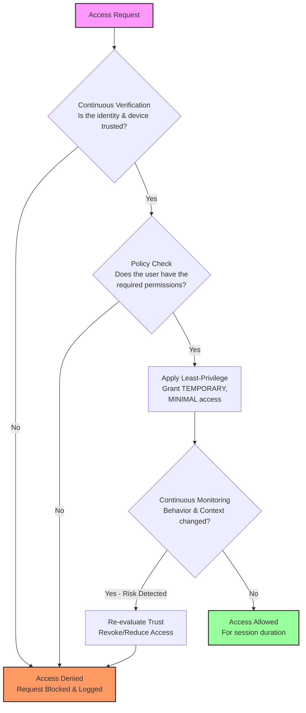

# 07 — Zero‑Trust + Least‑Privilege

- **Never trust, always verify**: identity, device, posture, context.
- **Brokered access**: IdP + JIT broker + short‑lived creds.
- **Continuous evaluation**: revoke if posture/drift changes.
- **Segmentation**: network + identity + data zones.
- **Data‑aware**: labels/classification drive ABAC conditions.
