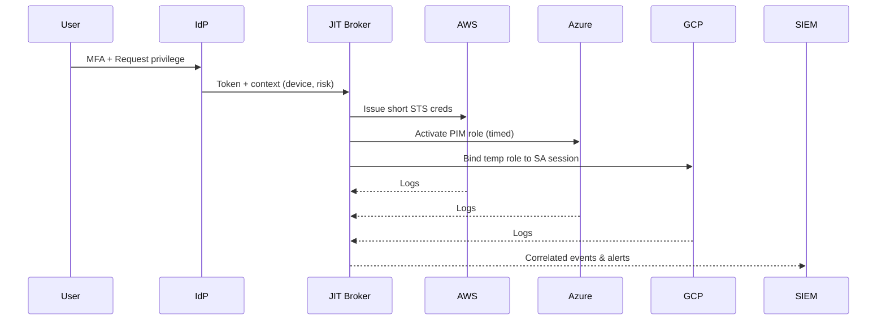

# 08 — Cross‑Cloud Identity & JIT Privilege

**Pattern**
- Central IdP (Okta/Entra) → SAML/OIDC federation to AWS/Azure/GCP.
- No standing admins; use **Privileged Access** systems for elevation.
- Central SIEM/SOAR monitors privilege creation & usage.

