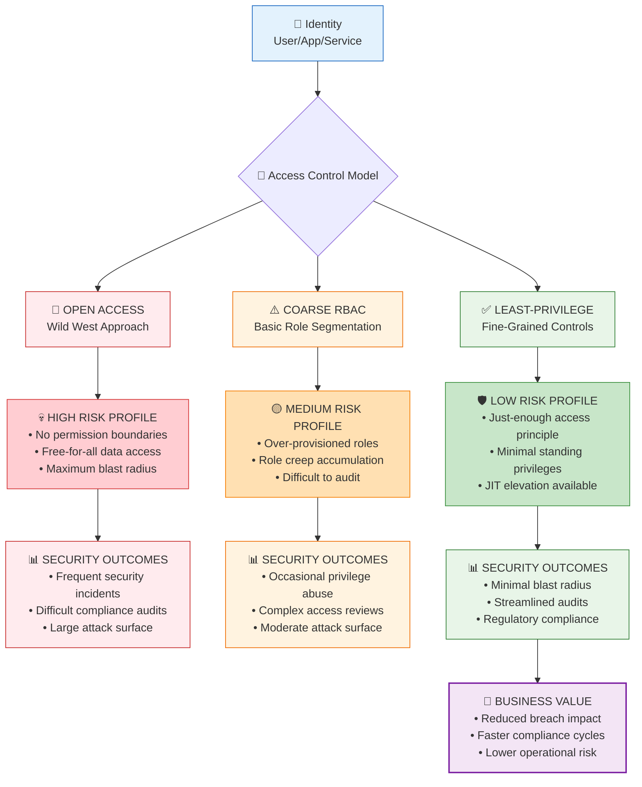

# 01 — Intro to Access Models

**Goal:** Understand access models and why **Least‑Privilege (LP)** reduces risk and blast radius.

**Key ideas**
- Give every identity **only** the permissions it needs—**no more**.
- Prefer **temporary elevation** (JIT) over standing privileges.
- Split duties; separate production‑change privileges from audit/monitor.
- **Measure & trim**: observe usage, remove unused rights regularly.

**Read next →** [02 — IAM Fundamentals](02_iam_fundamentals.md)
