# 01 — Intro to Access Models

**Goal:** Understand access models and why **Least‑Privilege (LP)** reduces risk and blast radius.

```mermaid
flowchart TD
    A[👤 Identity<br>User/App/Service] --> B{🔐 Access Control Model}
    
    B --> C["🚨 OPEN ACCESS<br>Wild West Approach"]
    C --> D["💀 HIGH RISK PROFILE<br>• No permission boundaries<br>• Free-for-all data access<br>• Maximum blast radius"]
    
    B --> E["⚠️ COARSE RBAC<br>Basic Role Segmentation"]
    E --> F["🟡 MEDIUM RISK PROFILE<br>• Over-provisioned roles<br>• Role creep accumulation<br>• Difficult to audit"]
    
    B --> G["✅ LEAST-PRIVILEGE<br>Fine-Grained Controls"]
    G --> H["🛡️ LOW RISK PROFILE<br>• Just-enough access principle<br>• Minimal standing privileges<br>• JIT elevation available"]
    
    D --> I["📊 SECURITY OUTCOMES<br>• Frequent security incidents<br>• Difficult compliance audits<br>• Large attack surface"]
    F --> J["📊 SECURITY OUTCOMES<br>• Occasional privilege abuse<br>• Complex access reviews<br>• Moderate attack surface"]
    H --> K["📊 SECURITY OUTCOMES<br>• Minimal blast radius<br>• Streamlined audits<br>• Regulatory compliance"]
    
    K --> L["🎯 BUSINESS VALUE<br>• Reduced breach impact<br>• Faster compliance cycles<br>• Lower operational risk"]

    style A fill:#e3f2fd,stroke:#1565c0
    style C fill:#ffebee,stroke:#c62828
    style D fill:#ffcdd2,stroke:#d32f2f
    style E fill:#fff3e0,stroke:#ef6c00
    style F fill:#ffe0b2,stroke:#f57c00
    style G fill:#e8f5e8,stroke:#2e7d32
    style H fill:#c8e6c9,stroke:#388e3c
    style I fill:#ffebee,stroke:#c62828
    style J fill:#fff3e0,stroke:#ef6c00
    style K fill:#e8f5e8,stroke:#2e7d32
    style L fill:#f3e5f5,stroke:#7b1fa2,stroke-width:2px
```

**Key ideas**
- Give every identity **only** the permissions it needs—**no more**.
- Prefer **temporary elevation** (JIT) over standing privileges.
- Split duties; separate production‑change privileges from audit/monitor.
- **Measure & trim**: observe usage, remove unused rights regularly.

**Read next →** [02 — IAM Fundamentals](02_iam_fundamentals.md)
