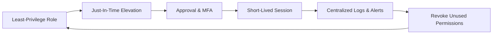

# 04 — Enforcing Least‑Privilege (Design Patterns)

- **Design with Deny‑by‑Default**: start with no access, add narrowly.
- **Break up duties**: deployer vs. auditor vs. incident‑responder.
- **Use conditions**: time, network, device posture, tag‑based (ABAC).
- **Short sessions**: STS durations, PIM activations, JIT brokers.
- **Guardrails**: SCP (AWS), Azure Policy, GCP Org Policies.
- **Review cadence**: monthly usage review, quarterly cert & recert.

