# Enforcing Least Privilege: Design Patterns & Implementation

```mermaid
flowchart TD
    A[📋 Access Request Initiated] --> B{🔍 Identity Verification}
    
    B -->|Failed| C[❌ Access Denied<br>Request Logged & Alerted]
    B -->|Success| D{👥 Role Mapping}
    
    D --> E[🏷️ RBAC<br>Role-Based Access Control]
    D --> F[📊 ABAC<br>Attribute-Based Access Control]
    D --> G[🔐 ReBAC<br>Relationship-Based Access Control]
    
    E --> H{JIT Access Required?}
    F --> H
    G --> H
    
    H -->|Yes| I[⏰ JIT Privileges<br>Time-bound elevation]
    H -->|No| J[📝 Static Permissions<br>Baseline access level]
    
    I --> K{🛡️ Policy Enforcement}
    J --> K
    
    K --> L[🔒 PEP<br>Policy Enforcement Point]
    L --> M[🧠 PDP<br>Policy Decision Point]
    M --> N{✅ Policy Evaluation}
    
    N -->|Compliant| O[✅ Access Granted<br>Minimal Privileges Applied]
    N -->|Violation| P[❌ Access Revoked<br>Security Incident Created]
    
    O --> Q[📈 Continuous Monitoring]
    P --> Q
    
    Q --> R{🎯 Behavior Analysis}
    R -->|Anomaly Detected| S[⚠️ Privilege Reduction<br>or Session Termination]
    R -->|Normal| T[🔄 Session Continues<br>with Least Privilege]
    
    S --> U[📊 Audit Trail Updated]
    T --> U
    
    U --> V[📋 Privilege Review Cycle]
    V --> W{🔄 Regular Recertification}
    W -->|Privileges Valid| A
    W -->|Privileges Excessive| X[📉 Rights Deprovisioning]
    X --> A

    style A fill:#e1f5fe,stroke:#01579b
    style C fill:#ffebee,stroke:#c62828
    style O fill:#e8f5e8,stroke:#2e7d32
    style P fill:#ffebee,stroke:#c62828
    style E,F,G fill:#f3e5f5,stroke:#7b1fa2
    style I fill:#fff3e0,stroke:#ef6c00
    style L,M fill:#e0f2f1,stroke:#00695c
```



## 🎯 Learning Objectives
- Design deny-by-default policies across AWS, Azure, and GCP
- Implement separation of duties in multi-cloud environments
- Configure attribute-based access control (ABAC)
- Establish Just-In-Time (JIT) access workflows
- Deploy guardrails and monitoring for continuous compliance

## 🏗️ Core Design Principles

### 1. Deny-by-Default Foundation
Start with zero trust - explicitly allow only what's necessary.

**AWS Example Policy:**
```json
{
    "Version": "2012-10-17",
    "Statement": [
        {
            "Effect": "Deny",
            "NotAction": [
                "s3:GetObject",
                "s3:ListBucket"
            ],
            "Resource": "*"
        }
    ]
}
Azure RBAC Approach:

Start with no permissions assigned

Use Azure Blueprints for baseline compliance

Implement Azure Policy for governance

GCP Organization Policies:

bash
# Deny all except explicitly allowed
gcloud resource-manager org-policies set-policy deny-all.yaml --organization=123456789
2. Separation of Duties (SoD)
Prevent conflicts of interest by splitting critical functions.

flowchart TD
    A[Developer] --> B[Write Code]
    C[Deployer] --> D[Deploy Infrastructure]
    E[Auditor] --> F[Review & Monitor]
    G[Security] --> H[Incident Response]
    
    B --> I[Code Repository]
    D --> J[Production Environment]
    F --> K[Compliance Reports]
    H --> L[Security Operations]
    
    style A fill:#e1f5fe
    style C fill:#f3e5f5
    style E fill:#e8f5e8
    style G fill:#fff3e0
Multi-cloud Role Mapping:
Function	AWS IAM Role	Azure RBAC	GCP IAM
Developer	PowerUserAccess (scoped)	Contributor (resource group)	Editor (project)
Deployer	AmazonECSFullAccess	Web Plan Contributor	Cloud Functions Admin
Auditor	SecurityAudit + ViewOnlyAccess	Reader + Log Analytics Reader	Logs Viewer + Security Reviewer
Security Admin	AdministratorAccess (with conditions)	Security Admin	Security Admin
🔧 Implementation Patterns
Pattern 1: Just-In-Time (JIT) Access
Temporary elevation for privileged tasks with approval workflows.

AWS Control Tower & AWS Organizations:

bash
# Enable JIT via Service Control Policies (SCPs)
aws organizations enable-policy-type \
    --root-id r-example \
    --policy-type SERVICE_CONTROL_POLICY
Azure Privileged Identity Management (PIM):

powershell
# Enable PIM for a subscription
Enable-AzureADMSPrivilegedIdentityGroup -GroupId $groupId

# Configure role settings
$settings = New-Object Microsoft.Open.MSGraph.Model.AzureADMSPrivilegedRuleSetting
$settings.RuleIdentifier = "ExpirationRule"
$settings.Setting = '{"maximumGrantPeriodInMinutes":480}'
GCP Essential Contacts & IAM Conditions:

bash
# Time-bound IAM conditions
gcloud projects add-iam-policy-binding my-project \
    --member='user:developer@company.com' \
    --role='roles/editor' \
    --condition='expression=request.time < timestamp("2024-01-01T00:00:00Z")'
Pattern 2: Attribute-Based Access Control (ABAC)
Dynamic permissions based on user, resource, or environment attributes.

AWS ABAC with Tags:

json
{
    "Version": "2012-10-17",
    "Statement": [
        {
            "Effect": "Allow",
            "Action": "ec2:*",
            "Resource": "*",
            "Condition": {
                "StringEquals": {
                    "aws:PrincipalTag/Department": "Engineering",
                    "aws:PrincipalTag/Environment": "Production"
                },
                "IpAddress": {
                    "aws:SourceIp": ["10.0.0.0/16"]
                }
            }
        }
    ]
}
Azure ABAC with Conditions:

json
{
    "condition": {
        "allOf": [
            {
                "field": "principal.assignedrole",
                "equals": "owner"
            },
            {
                "field": "resource.location",
                "in": ["eastus", "westus"]
            }
        ]
    }
}
Pattern 3: Break-Glass Access
Emergency procedures for critical situations with strict controls.

Break-Glass Requirements:

⏰ Maximum 4-hour duration

👥 Dual approval required

📝 Immediate security review triggered

🔍 Extensive logging and monitoring

🚨 Automatic alerting to security team

🛡️ Multi-Cloud Guardrails
AWS Guardrails
yaml
# Service Control Policy (SCP) Example
- sid: DenyOutsideOrg
  effect: Deny
  actions:
    - ec2:LeaveOrganization
    - organizations:LeaveOrganization
  resources: ['*']

- sid: RequireIMDSv2
  effect: Deny
  actions: ['ec2:RunInstances']
  condition:
    Null:
      aws:EC2InstanceSourceIdentity: 'true'
Azure Policy Controls
json
{
    "policyRule": {
        "if": {
            "allOf": [
                {
                    "field": "type",
                    "equals": "Microsoft.Resources/subscriptions"
                },
                {
                    "field": "Microsoft.Resources/subscriptions/owner",
                    "exists": "false"
                }
            ]
        },
        "then": {
            "effect": "audit"
        }
    }
}
GCP Organization Policies
bash
# Disable service account key creation
gcloud resource-manager org-policies enable-enforce \
    iam.disableServiceAccountKeyCreation

# Enforce public access prevention
gcloud resource-manager org-policies enable-enforce \
    storage.publicAccessPrevention
📊 Monitoring & Compliance
Continuous Access Reviews
AWS IAM Access Analyzer:

bash
# Generate policy validation
aws accessanalyzer validate-policy \
    --policy-document file://policy.json \
    --policy-type IDENTITY_POLICY

# List unused permissions
aws iam generate-service-last-accessed-details \
    --arn arn:aws:iam::123456789012:user/Developer
Azure Access Reviews:

powershell
# Create access review
New-AzAccessReview \
    -DisplayName "Quarterly Developer Access Review" \
    -Description "Review developer permissions" \
    -Scope "/subscriptions/12345678-1234-1234-1234-123456789012" \
    -ReviewerType "Manager" \
    -Interval 3 \
    -DurationInDays 7
GCP Policy Troubleshooter:

bash
# Analyze IAM policies
gcloud policy-troubleshooter troubleshoot-iam \
    --resource-uri="//cloudresourcemanager.googleapis.com/projects/my-project" \
    --principal-email="user@company.com" \
    --permission-names="storage.buckets.get"
Security Metrics Dashboard
graph LR
    A[Excessive Permissions] --> B[Monthly Access Reviews]
    B --> C[JIT Utilization Rate]
    C --> D[Policy Violations]
    D --> E[Security Incidents]
    E --> F[Mean Time to Remediate]
    F --> A
🧪 Implementation Checklist
Foundation Setup
Establish deny-by-default baseline

Define role hierarchy and separation of duties

Configure centralized logging across all clouds

Implement tagging standards for ABAC

Access Controls
Deploy JIT access workflows

Configure ABAC policies

Establish break-glass procedures

Set up conditional access policies

Governance & Monitoring
Enable continuous access reviews

Configure guardrails and policies

Set up security alerts and notifications

Establish compliance reporting

Operational Excellence
Document all policies and procedures

Train teams on least privilege principles

Establish incident response playbooks

Regular testing and validation

🚀 Next Steps
Implement one design pattern at a time

Monitor effectiveness through security metrics

Iterate based on feedback and incidents

Automate compliance checks and remediation

Next: Failure Scenario & Remediation
Previous: IAM Fundamentals
