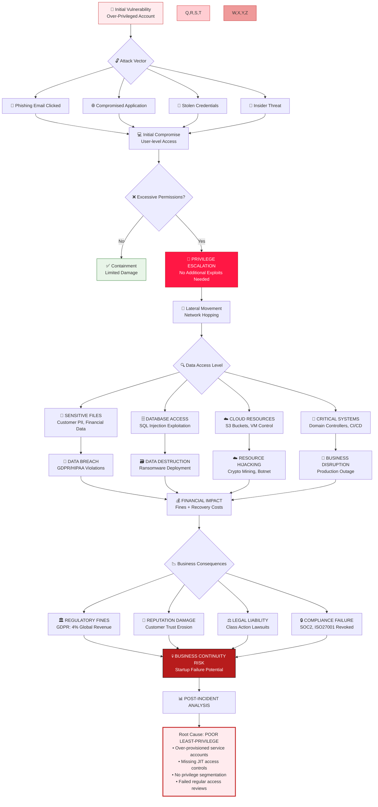

# Failure Scenario: Consequences of Poor Least-Privilege Implementation



## 🚨 Real-World Breach Scenario

### The Setup
**Company**: TechStartup Inc.  
**Cloud**: Multi-cloud (AWS, Azure, GCP)  
**Mistake**: Developer teams granted `AdministratorAccess` for "development speed"  
**Trigger**: Developer laptop compromised via phishing attack

### The Attack Chain
```mermaid
sequenceDiagram
    participant A as Attacker
    participant D as Developer Laptop
    participant AWS as AWS Account
    participant AZ as Azure Subscription
    participant GCP as GCP Project
    
    A->>D: Phishing email → Malware installed
    D->>AWS: Use stored admin credentials
    A->>AWS: Assume developer IAM role
    AWS->>A: Full administrative access
    A->>AWS: Create backdoor IAM user
    A->>AWS: Disable CloudTrail logging
    A->>AWS: Exfiltrate S3 data
    A->>AZ: Compromise Azure resources
    A->>GCP: Access GCP projects
🔓 Vulnerabilities Exposed
AWS Vulnerabilities
IAM Privilege Escalation

Create new IAM users with admin rights

Attach policies to existing roles

Modify existing IAM policies

Data Exposure

S3 bucket data exfiltration

RDS database access

Secrets Manager credential theft

Infrastructure Compromise

EC2 instance backdoors

Lambda function modification

ECR image poisoning

Azure Vulnerabilities
Subscription-level Access

Create new resources (VMs, storage)

Modify network security groups

Access Key Vault secrets

Identity Compromise

Create new service principals

Modify Azure AD applications

Elevate privileges via PIM

GCP Vulnerabilities
Project-level Breach

Create service accounts with broad permissions

Access Cloud Storage buckets

Modify Compute Engine instances

Data Access

BigQuery dataset exposure

Cloud SQL database access

Storage object downloads

🔍 Detection Methods
AWS Detection
bash
# Check for suspicious IAM activity
aws cloudtrail lookup-events --lookup-attributes AttributeKey=EventName,AttributeValue=CreateUser

# Analyze IAM policies for over-permissioning
aws iam generate-service-last-accessed-details --arn arn:aws:iam::123456789012:user/Developer

# Monitor for policy changes
aws cloudtrail lookup-events --lookup-attributes AttributeKey=EventName,AttributeValue=PutRolePolicy
Azure Detection
powershell
# Check role assignments
Get-AzRoleAssignment | Where-Object {$_.RoleDefinitionName -eq "Owner"}

# Monitor activity logs
Get-AzLog -StartTime (Get-Date).AddHours(-24) | Where-Object {$_.OperationName -like "*write*"}
GCP Detection
bash
# Check IAM policy bindings
gcloud asset analyze-iam-policy --organization=123456789

# Monitor audit logs
gcloud logging read "resource.type=iam_service_account" --limit=10
🛡️ Remediation Steps
Immediate Containment
Revoke Compromised Credentials

bash
# AWS - Delete compromised user
aws iam delete-user --user-name compromised-user

# Azure - Remove role assignments
Remove-AzRoleAssignment -SignInName attacker@company.com

# GCP - Remove IAM bindings
gcloud projects remove-iam-policy-binding my-project \
  --member=user:attacker@company.com --role=roles/owner
Rotate All Secrets

IAM access keys

Service account keys

Database credentials

API tokens

Long-term Fixes
Implement Least Privilege

json
{
    "Version": "2012-10-17",
    "Statement": [
        {
            "Effect": "Allow",
            "Action": [
                "s3:GetObject",
                "s3:ListBucket"
            ],
            "Resource": "arn:aws:s3:::specific-bucket/*"
        }
    ]
}
Enable Monitoring & Alerting

CloudTrail alerts for IAM changes

Azure Activity Log alerts

GCP Audit Log monitoring

Cost anomaly detection

Implement JIT (Just-In-Time) Access

Temporary elevation for admin tasks

Time-bound permissions

Approval workflows

🧪 Hands-On Lab: Detect & Remediate
Lab Objective
Simulate a privilege escalation attack and practice detection/remediation.

Steps
Setup: Create over-privileged IAM role

Simulate: Generate suspicious API calls

Detect: Use CloudTrail to identify anomalies

Remediate: Apply least-privilege principles

Prevent: Implement guardrails

Expected Outcomes
Understand attack patterns

Practice detection techniques

Implement proper remediation

Design preventive controls

📊 Lessons Learned
Key Takeaways
Never grant administrative access for convenience

Regular access reviews are critical

Monitoring must be proactive, not reactive

Least privilege reduces blast radius

Security Metrics to Track
Percentage of identities with excessive permissions

Time to detect privilege misuse

Number of JIT access requests

Access review completion rate


