# 06 — Lab: Detect & Remove Unused Permissions

```mermaid
flowchart TD
    A[🚀 START: Permission Governance Program] --> B[📊 Data Collection Phase]
    
    B --> C[🔍 Permission Discovery Engine]
    C --> D["🗃️ Cloud Trail & Logs<br>API Calls, Service Usage"]
    C --> E["📝 SIEM & Monitoring Tools<br>User Activity Logs"]
    C --> F["🔧 IAM & Directory Services<br>Role Assignments, Group Memberships"]
    C --> G["📦 Application Logs<br>Database Queries, App Actions"]
    
    D --> H[📈 Data Aggregation & Correlation]
    E --> H
    F --> H
    G --> H
    
    H --> I[🎯 Analysis Phase]
    I --> J{🔎 Usage Pattern Analysis}
    
    J --> K["✅ ACTIVE PERMISSIONS<br>• Regular usage patterns<br>• Recent activity<br>• Business justification"]
    J --> L["⚠️ DORMANT PERMISSIONS<br>• No recent usage 30-90 days<br>• Seasonal/occasional use<br>• Requires validation"]
    J --> M["❌ UNUSED PERMISSIONS<br>• Zero usage >90 days<br>• Orphaned service accounts<br>• Role creep accumulation"]
    
    K --> N[🔄 Keep in Production]
    L --> O[🔔 Notification & Validation]
    M --> P[🚨 High-Risk Identification]
    
    O --> Q{📞 Owner Validation}
    Q -->|Business Need Confirmed| R[📅 Schedule for JIT<br>Convert to Just-in-Time]
    Q -->|No Response| S[⏰ Grace Period 14 days<br>Then auto-escalate]
    Q -->|No Business Need| T[🎯 Mark for Removal]
    
    P --> U[🔴 Critical Unused Permissions]
    U --> V["• Admin/Super-user roles<br>• Production database access<br>• Financial system permissions<br>• Security control bypass rights"]
    
    R --> W[🛡️ Remediation Phase]
    S --> W
    T --> W
    V --> W
    
    W --> X{🎯 Remediation Strategy}
    X --> Y["🔄 JIT ENABLEMENT<br>Convert to time-bound access<br>with approval workflow"]
    X --> Z["📉 PRIVILEGE REDUCTION<br>Downgrade to lower privilege level<br>based on actual needs"]
    X --> AA["🗑️ PERMISSION REMOVAL<br>Complete deprovisioning<br>from user/role"]
    
    Y --> BB[⚡ Execute Changes]
    Z --> BB
    AA --> BB
    
    BB --> CC[📝 Change Documentation]
    CC --> DD["• Update IAM policies<br>• Modify role definitions<br>• Update CMDB records<br>• Security policy compliance"]
    
    DD --> EE[🔒 Verification & Validation]
    EE --> FF{✅ Change Verification}
    FF -->|Success| GG["🎉 SUCCESS<br>Reduced attack surface<br>Improved security posture"]
    FF -->|Failed| HH["🔄 Rollback & Analysis<br>Fix implementation issues"]
    
    GG --> II[📅 Schedule Next Review<br>Continuous monitoring cycle]
    HH --> II
    
    II --> JJ["🏁 COMPLETION<br>• Updated permission matrix<br>• Reduced privileged accounts<br>• Compliance evidence collected"]

    style A fill:#e3f2fd,stroke:#1565c0
    style K fill:#e8f5e8,stroke:#2e7d32
    style L fill:#fff3e0,stroke:#ef6c00
    style M fill:#ffebee,stroke:#c62828
    style V fill:#fce4ec,stroke:#c2185b,stroke-width:2px
    style GG fill:#e8f5e8,stroke:#2e7d32,stroke-width:2px
    style JJ fill:#e1f5fe,stroke:#0277bd,stroke-width:2px
```




## AWS — Service Last Accessed
```bash
POL_ARN=arn:aws:iam::<ACC>:policy/YourPolicy
JOB=$(aws iam generate-service-last-accessed-details --arn $POL_ARN --query JobId --output text)
aws iam get-service-last-accessed-details --job-id "$JOB" > last-access.json
# Review services with "TotalAuthenticatedEntities"==0 and trim actions
```

## Azure — Access Review (PIM)
- Create an **Access Review** for a high‑value resource group.
- Require justification & auto‑remove non‑responders.

## GCP — IAM Recommender
```bash
gcloud recommender recommendations list   --recommender=google.iam.policy.Recommender   --project=<PROJECT>
# Apply carefully; review diffs.
```

**Success criteria**
- Policy diff shows **fewer actions** with same job success.
- New alerts fire if someone tries disallowed actions.
